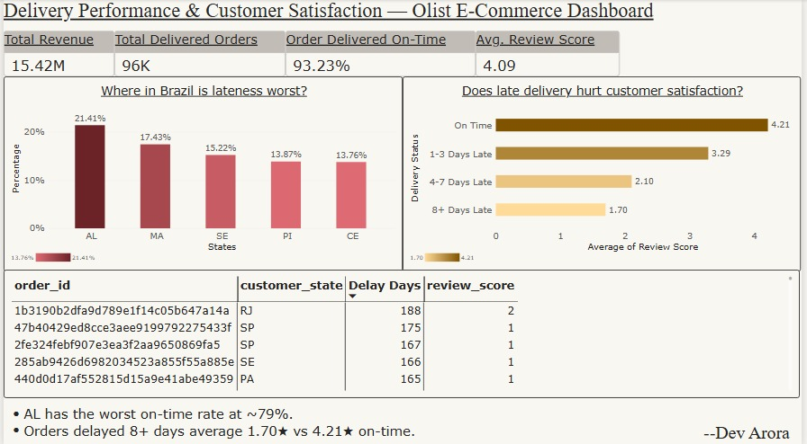

**Power BI dashboard analyzing 99K+ Olist e-commerce orders — late deliveries (8+ days) saw review scores drop from 4.21 to 1.70. Includes state-level lateness breakdown and a drill-through table of worst-delayed orders. Built in Power Query + DAX.**
# Delivery Performance & Customer Satisfaction Dashboard

An end-to-end Power BI project analyzing 99K+ orders from the Olist Brazilian e-commerce dataset to answer one question: **does late delivery hurt customer satisfaction, and where in Brazil is it worst?**

## Process

Data was cleaned and modeled in Power Query across 9 relational tables — orders, order items, payments, customers, sellers, products, and reviews — joined into a star schema with a dedicated date table for time intelligence. Grain mismatches (multiple order items and payment installments per order) were resolved before modeling to avoid duplicate rows and inflated metrics.

Key DAX measures calculate delivery delay (actual vs. estimated delivery date), bucket orders into delay ranges (On Time, 1-3 Days Late, 4-7 Days Late, 8+ Days Late), and compute on-time delivery rate, late delivery rate, and average review score per bucket. Data quality checks were run throughout — including catching a duplicate-count bug from DAX's blank/false coercion in boolean filters, and flagging outlier delay values for exclusion.

## Findings

- Orders delivered **8+ days late** saw average review scores drop to **1.70** out of 5, compared to **4.21** for on-time orders — a clear, consistent decline across every delay bucket.
- **Alagoas (AL)** has the worst on-time delivery rate in Brazil, at roughly **79%**, with Maranhão and Sergipe close behind.
- Overall on-time delivery rate across all delivered orders sits at **93.23%**.

## Dashboard

A single-page dashboard presents: KPI summary cards (revenue, delivered orders, on-time %, average review score), a state-level lateness comparison, a delay-bucket vs. review-score chart, and an interactive drill-through table of the worst-delayed individual orders — sorted so the biggest outliers surface first.

## Tools

Power BI Desktop, Power Query (M), DAX

## Dataset

[Olist Brazilian E-Commerce Public Dataset](https://www.kaggle.com/datasets/olistbr/brazilian-ecommerce), Kaggle.
